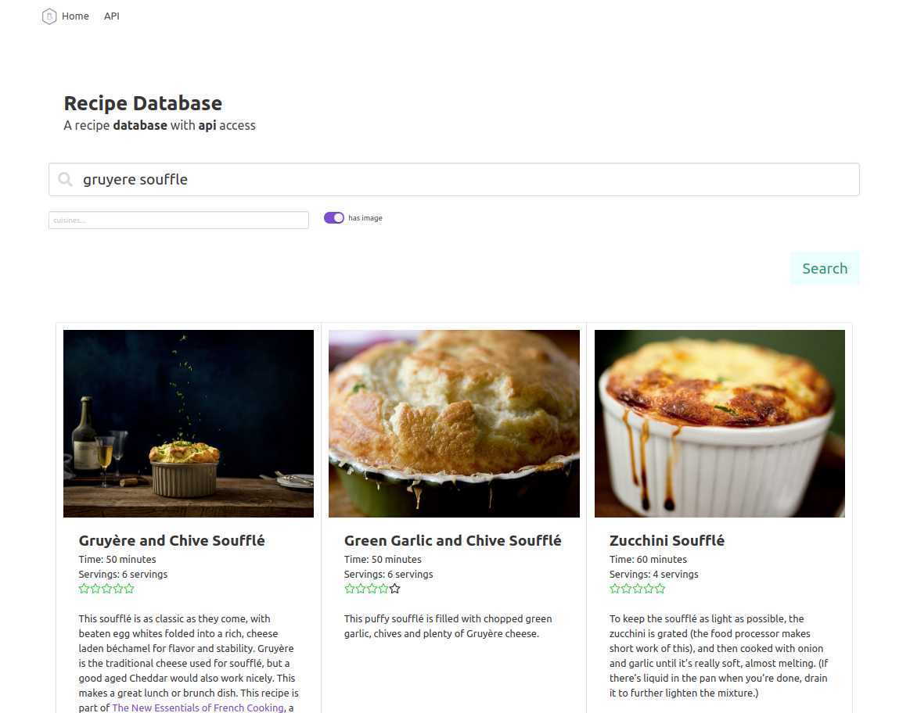
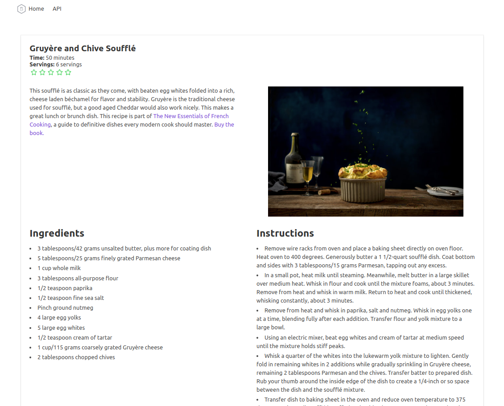

# Recipe API

This is an open source recipe database and api.

### Overview

- The recipes are stored in a postgres database with [full-text search](https://www.postgresql.org/docs/9.5/textsearch.html) enabled
- The REST API powers the single-page-application front-end
- The seed data was *collected* from the NYT Cooking service

### Technology

- python 3
- django 3
- django rest framework
- vue 2
- postgres

### Screenshots

#### Search

#### Result

### Development

Start postgres:

    docker-compose up -d postgres
    
Install python dependencies:

    pip install -r requirements.txt
    
Create database and tables:

    python manage.py migrate    

Create cache tables:

    python manage.py createcachetable 
    
Create superuser for admin:

    python manage.py createsuperuser
    
Scrape recipes:

    python manage.py scrape --urls --recipes
        
Run web server:    
    
    DEBUG=1 python manage.py runserver
    
URL: http://localhost:8000

### Deployment

*Clone repo first.*

Bring up everything:

    docker-compose up -d

Deploy front-end updates:

    git pull
    docker-compose up --force-recreate -d recipes

Deploy front and back-end:

    git pull
    docker-compose up --build --force-recreate -d recipes

Force scrape:

    docker-compose exec recipes python manage.py scrape --urls --recipes --force

### Helpers

Clear cache:

    docker-compose exec recipes python manage.py shell
    from django.core.cache import cache
    cache.clear()
